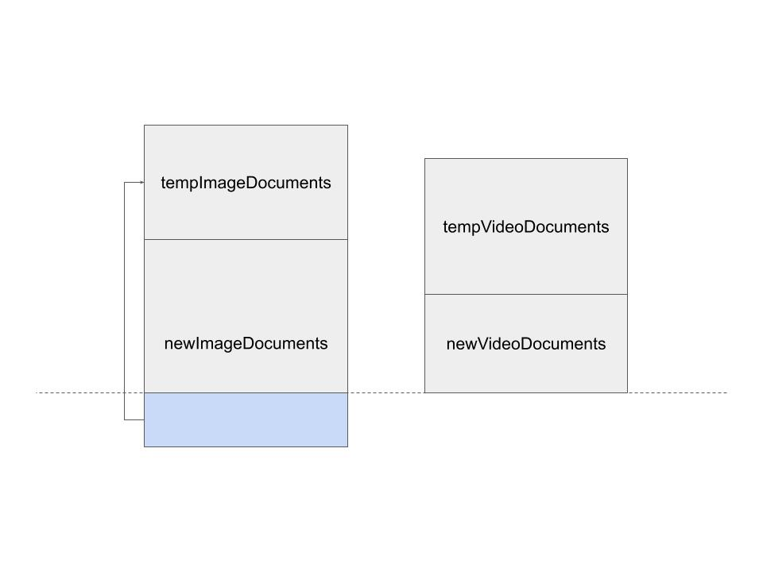

# search-application

### 스택

- MVVM 패턴 & App architecture (클린 아키텍처)
- Coroutine & Flow
- Retrofit
- Glide 이미지 캐싱
- AAC ( ViewModel, Paging, Lifecycle with flow )
- DataBinding
- DI with Hilt
- Unit/UI test

### 구조

|  |
|:--:|
| *앱 구조* |

|  |
|:--:|
| *Layer, 모듈에 따른 세부구조* |

### Paging Source 구현

image, video 문서를 모아서 최신순으로 정렬된 page 형식으로 제공한다.

<ol>
  <li>새로운 페이지의 image, video 문서를 각각 최신순으로 가져온다.</li>
  <li>마지막 image 문서, video 문서 중 빠른 날짜를 선택한다.</li>
  <li>해당 날짜보다 늦은 문서는 임시로 저장한다.</li>
  <li>임시로 저장한 문서는 다음 페이지의 image, video 문서를 가져올 때 이어붙인다.</li>
</ol>

|  |
|:--:|
| *Paging Source* |
